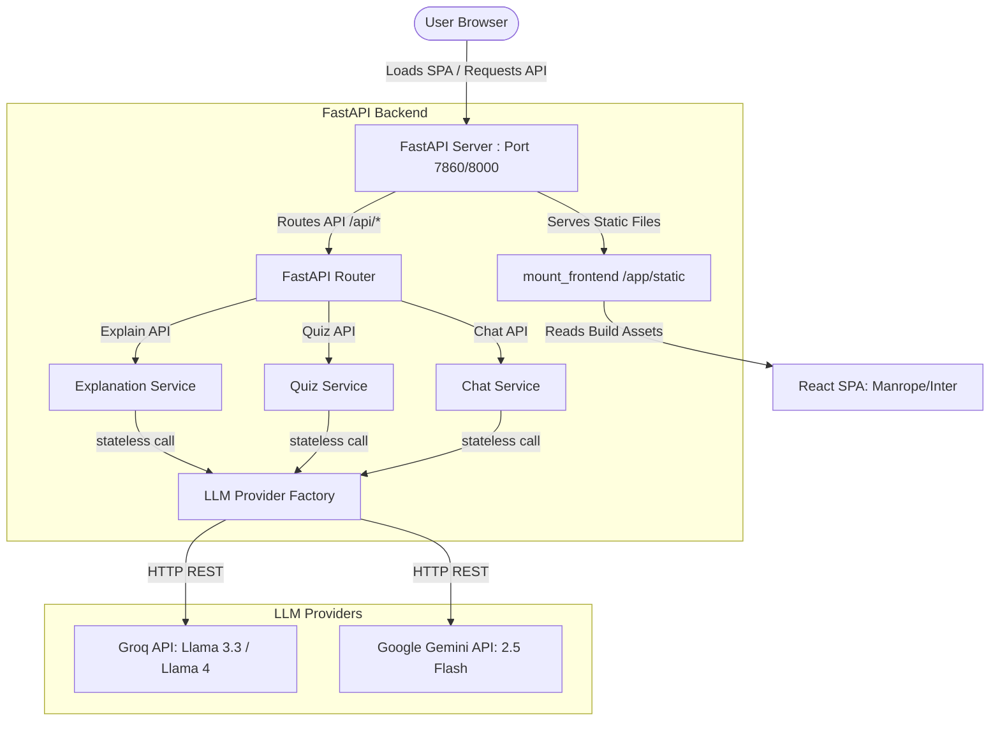

# 🌟 CodeExplain — Plain-English Code Tutor

<div align="center">

[](https://codeexplain-lsrb.onrender.com/)
[](https://fastapi.tiangolo.com)
[](https://react.dev)
[](https://www.typescriptlang.org)
[](https://tailwindcss.com)

**A premium, production-quality, AI-powered code explanation and interactive learning application.**  
*Paste any complex code snippet, select the programming language, and receive a structured, educational breakdown.*

---

[Key Features](#-key-features) • [Design System](#-design-system-notes) • [Master Build Prompt (`PROMPT.md`)](#-master-build-prompt-promptmd) • [Architecture](#-architecture) • [Getting Started](#-getting-started) • [Creator](#-created-by)

</div>

---

## ⚡ Key Features

CodeExplain is built around two primary feature tiers ensuring deep comprehension and educational rigor:

### Tier 1 — Core Analysis (Required)
- 📝 **Plain-English Explanation**: Detailed, beginner-friendly walkthroughs of code purpose, mechanics, and design patterns.
- ⏱️ **Complexity Analysis**: Concrete, code-specific evaluation of time and space complexity ($O(n)$, $O(\log n)$, etc.).
- 🔍 **Line-by-Line Commentary**: Interactive line numbers mapped directly to plain-English breakdowns of operational logic.
- 💡 **Actionable Improvements**: Real suggestions targeting code legibility, performance, security, and idiomatic correctness.
- 📋 **Structural Consistency**: Outputs are strictly formatted under a standardized JSON schema across all supported languages and models.

### Tier 2 — High-Priority Additions
- 🎓 **Interactive Quiz Mode**: Generates a custom 3-5 question comprehension quiz dynamically from *your* code snippet.
- 💬 **AI Follow-Up Chat**: Lightweight chat session to ask questions about the analyzed code.
- 📥 **Markdown & PDF Export**: One-click download of the complete code breakdown as formatted Markdown or a clean PDF document.
- 💾 **Persistent Local Session**: Automatically saves history and user preferences using `localStorage`. Complete privacy—no user history is ever uploaded to a database.
- 📂 **Example Snippets**: Ready-to-go snippets (Python, JS, C++, C) to test the app instantly.
- 🎨 **About/Creator Page**: A polished page explaining the motivation behind CodeExplain.

---

## 📐 Design System Notes

CodeExplain implements the **Stitch Design System** focusing on rich aesthetics, premium dark-mode panels, and smooth micro-animations.

*   **Typography**: Google Sans/Google Sans Text are not freely licensed. CodeExplain deliberately substitutes:
    *   **Display/Headings**: [Manrope](https://fonts.google.com/specimen/Manrope) (geometric, modern, and confident display scale).
    *   **Body/UI Text**: [Inter](https://fonts.google.com/specimen/Inter) (highly readable, accessible, and clean at smaller font sizes).
*   **Colors**: A curated dark-mode palette consisting of sleek surface cards (`--color-surface-card`), accent borders, and glowing CTA buttons.
*   **Visual Language**: Responsive layout, glassmorphic card patterns, and focus-ring states that are fully compliant with WCAG AA accessibility standards.

---

## 📄 Master Build Prompt (`PROMPT.md`)

This codebase was generated using a high-fidelity system prompt located at [PROMPT.md](file:///Users/fayaskhan/Downloads/CodeLearn-main/PROMPT.md). 

### What Type of Prompt is This?
`PROMPT.md` is a **Master Build Prompt / System Specification Prompt**. Unlike simple chat instructions, this prompt is an exhaustive, deterministic technical blueprint that dictates:
1. **Operating Principles**: Zero code branching, strict dependency control, and fail-fast validation.
2. **Visual Standards**: Full CSS variables, typography mappings, border radii, and layout constraints.
3. **API Contracts**: JSON schemas, route endpoints, error handling shapes, and failover/retry strategies.
4. **Environment Controls**: Port configuration, Docker multi-stage layouts, and production vs. preview conditions.

### Why Was This Used?
*   **Architectural Consistency**: It ensures that both the React frontend and FastAPI backend follow identical specifications, matching types and REST payloads with zero configuration mismatch.
*   **Autonomous Engineering**: It serves as a comprehensive frame of reference for AI coding agents to write, debug, and optimize code without architectural drift or feature creep.
*   **Deployability**: By defining the Hugging Face Docker Space single-container model at the prompt level, the project builds into a single process serving the React SPA and API seamlessly.

---

## 🏗️ Architecture



CodeExplain uses a **stateless, single-container architecture**:
- **Frontend**: A React single-page application communicating with the backend via native typed fetch endpoints.
- **Backend**: A FastAPI server that handles LLM orchestration and serves static React assets in production.
- **Stateless Integration**: No user data or chat logs are preserved on the server. Request isolation is strictly maintained.

---

## 🚀 Getting Started

### Prerequisites
- Python 3.11 or higher
- Node.js 18+ and npm

### Local Development

#### 1. Backend Setup
1. Navigate to the backend directory:
   ```bash
   cd backend
   ```
2. Create and activate a virtual environment:
   ```bash
   python3 -m venv .venv
   source .venv/bin/activate  # On Windows: .venv\Scripts\activate
   ```
3. Install Python dependencies:
   ```bash
   pip install -r requirements.txt
   ```
4. Copy the environment template and fill in your API keys (Groq/Gemini):
   ```bash
   cp .env.example .env
   ```
5. Launch the FastAPI server:
   ```bash
   python server.py
   ```
   *The backend will boot on [http://localhost:8000](http://localhost:8000).*

#### 2. Frontend Setup
1. Navigate to the frontend directory:
   ```bash
   cd ../frontend
   ```
2. Install Node packages:
   ```bash
   npm install
   ```
3. Set the backend endpoint in your local configuration:
   ```bash
   cp .env.example .env
   # Ensure REACT_APP_BACKEND_URL is set to http://localhost:8000
   ```
4. Start the React development server:
   ```bash
   npm start
   ```
   *The client will start on [http://localhost:3000](http://localhost:3000).*

---

## 🐳 Production Build (Docker)

To run the unified, single-container build locally or prepare for production hosting:

1. Build the Docker image from the root directory:
   ```bash
   docker build -t codeexplain:latest .
   ```
2. Run the container:
   ```bash
   docker run -p 7860:7860 \
     -e GROQ_API_KEY="your_groq_api_key_here" \
     -e GEMINI_API_KEY="your_gemini_api_key_here" \
     -e ACTIVE_PROVIDER="groq" \
     -e ACTIVE_MODEL="llama-3.3-70b-versatile" \
     codeexplain:latest
   ```
3. Open [http://localhost:7860](http://localhost:7860) to view your running application.

---

## 👨‍💻 Created By

**Mohammad Fayas Khan**  
*Computer Science Engineering Student & Full-Stack AI Developer*

- 🌐 [Portfolio / Live Demo](https://codeexplain-lsrb.onrender.com/)
- 🖥️ [GitHub](https://github.com/MohammadFayasKhan)
- 💼 [LinkedIn](https://www.linkedin.com/in/mohammadfayaskhan)
- 📸 [Instagram](https://www.instagram.com/fayaskhanx)

---

<div align="center">
© 2026 CodeExplain • Crafted by Mohammad Fayas Khan  
<small>This project was created to make programming concepts easier to understand through AI-powered explanations and an exceptional user experience.</small>
</div>
