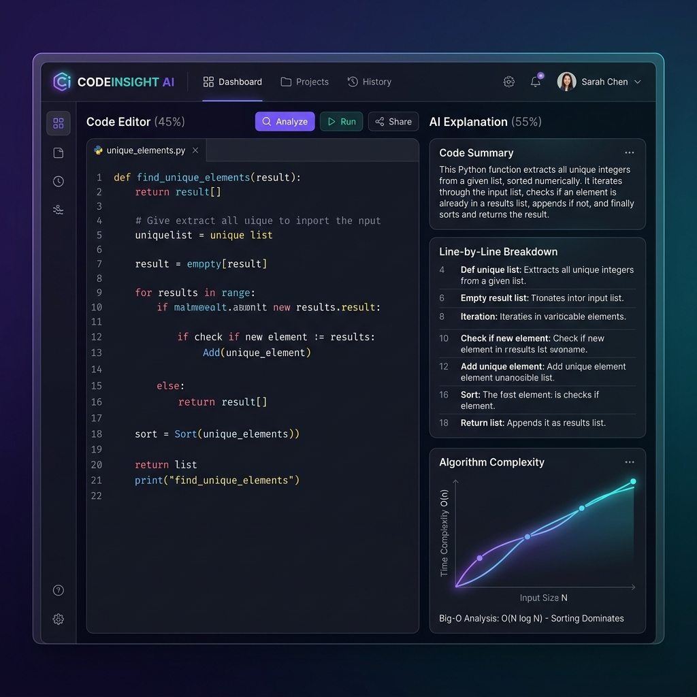
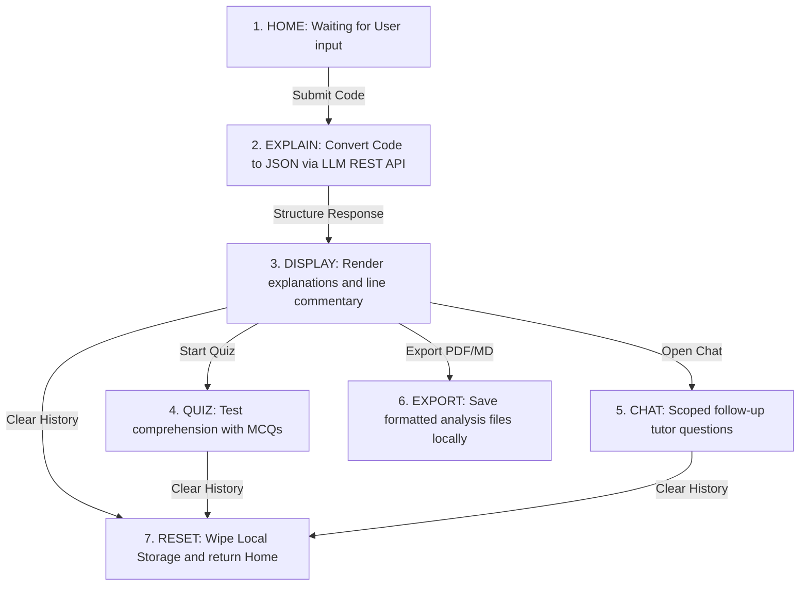

<div align="center">

# CodeExplain 💡

**A sleek, dark-themed code tutor powered by Groq's high-speed Llama 3/Qwen models and Google's Gemini APIs, with a FastAPI backend and React/TypeScript frontend.**

[](https://react.dev)
[](https://fastapi.tiangolo.com)
[](https://www.typescriptlang.org)
[](https://tailwindcss.com)
[](https://codeexplain-lsrb.onrender.com/)
[](LICENSE)

<br/>

<p align="center">
  
</p>

> 🚀 **Live Demo:** [https://codeexplain-lsrb.onrender.com/](https://codeexplain-lsrb.onrender.com/)

</div>

---

## 📖 Overview

CodeExplain turns raw, complex code snippets into structured, educational, and interactive study pages. Paste any block of code, choose its language (Python, JavaScript, TypeScript, C++, C, Go, etc.), and select an AI provider. In under 3.5 seconds, CodeExplain streams a deterministic JSON schema containing a complete summary, beginner-friendly explanations, Big-O complexity analysis, line-by-line runtime walkthroughs, and actionable improvements.

Every single visual transition (boot, home, loading, results, chat, quiz, error, success) is animated smoothly using non-blocking, modern layout architectures. There isn't a single blocking operation in the user interaction path.

---

## 🔄 System Flow



---

## ✨ Features

- **Structural Code Breakdown:** Pediatric summaries focused on the "why" and "how" of code blocks.
- **Big-O Complexity Graph:** Correct Time and Space complexity metrics visualized on an interactive graph.
- **Interactive Line Gutter:** Hovering over lines of code highlights corresponding explanatory annotations.
- **Dynamic Quiz Panel:** Evaluates your understanding with 3-5 multiple-choice questions compiled from your code snippet.
- **Context-Scoped Follow-Up Chat:** Ask specific follow-up questions about the code snippet. Conversation history is maintained per browser tab session.
- **Markdown & PDF Export:** One-click downloads to save your structural reports offline.
- **Privacy-First Local Storage:** Saves history and settings locally. Data never leaves your device and can be cleared instantly.

---

## 💻 Tech Stack & Dependencies

### Frontend
| Technology | Purpose | Notes |
|---|---|---|
| React 18 | Client SPA UI | Powered by modern state Hooks and React-Router-DOM |
| TypeScript | Type safety | Complete type parity with backend Pydantic models |
| Tailwind CSS | Styling system | Styled using the custom geometric Stitch design system |
| Framer Motion | Smooth UI Animations | Manages 60 FPS transitions, drawer reveals, and entry fades |
| jsPDF | Client-side PDF export | Compiles analysis results into print-ready PDF files |
| Monaco Editor | Code input terminal | Code highlighting and syntax checking for multiple languages |

### Backend
| Technology | Purpose | Notes |
|---|---|---|
| Python 3.11+ | Execution engine | Stateless backend orchestration |
| FastAPI | REST API Server | Fast, async router handling `/api/*` endpoints |
| Pydantic v2 | Schema validation | Enforces strict validation shapes on LLM outputs |
| HTTPX | LLM Provider gateway | Handles retries and connection pooling for Groq/Gemini calls |

---

## 📁 Project Structure

```
CodeLearn/
├── backend/
│   ├── app/
│   │   ├── api/routes/         # Endpoint routing (explain, chat, quiz, health, models)
│   │   ├── config/             # Model registries and environment settings
│   │   ├── core/               # Exception handling and app overrides
│   │   ├── models/             # Pydantic schemas (Request & Response contracts)
│   │   ├── prompts/            # System instruction prompts for LLM providers
│   │   ├── services/           # Orchestration logic (explanation, chat, and quiz handlers)
│   │   ├── static.py           # Static mount routing for React build assets (SPA fallback)
│   │   └── main.py             # FastAPI startup and middleware configuration
│   ├── server.py               # Backend gateway entrypoint
│   └── requirements.txt        # Python package manifest
├── frontend/
│   ├── public/                 # Static assets and index wrapper
│   ├── src/
│   │   ├── components/         # Modular components (chat, input, layout, quiz, result, shared)
│   │   ├── hooks/              # Async hooks (useExplain, useQuiz, useChat)
│   │   ├── lib/                # API fetch wrappers, type mappings, storage handlers
│   │   ├── examples/           # Pre-built code samples for instant demoing
│   │   ├── App.tsx             # Root router and layout wrapper
│   │   ├── index.tsx           # Dom mounter
│   │   └── index.css           # Global typography, Stitch tokens, and animations
│   ├── package.json            # Node configuration
│   └── tsconfig.json           # TypeScript rules
├── static/
│   └── preview.png             # UI preview image
├── Dockerfile                  # Production multi-stage build container
├── PROMPT.md                   # Master Build Prompt (technical blueprint)
└── README.md                   # Repository documentation
```

---

## 🚀 Getting Started

### Prerequisites

- **Python 3.11+** installed
- **Node.js 18+ and npm** installed
- An API key for **Groq** or **Google Gemini**

### 1. Clone the repo

```bash
git clone https://github.com/MohammadFayasKhan/CodeLearn.git
cd CodeLearn
```

### 2. Configure Local Settings

#### Backend Environment Setup
Create a `.env` file in the `backend/` directory:
```env
GROQ_API_KEY="your_groq_api_key_here"
GEMINI_API_KEY="your_gemini_api_key_here"
ACTIVE_PROVIDER="groq"
ACTIVE_MODEL="llama-3.3-70b-versatile"
ALLOWED_ORIGIN="http://localhost:3000"
LOG_LEVEL="INFO"
```

#### Frontend Environment Setup
Create a `.env` file in the `frontend/` directory:
```env
REACT_APP_BACKEND_URL="http://localhost:8000"
```

### 3. Run the App

#### Start Backend
```bash
cd backend
python3 -m venv .venv
source .venv/bin/activate
pip install -r requirements.txt
python server.py
```
*Backend runs at [http://localhost:8000](http://localhost:8000)*

#### Start Frontend
```bash
cd ../frontend
npm install
npm start
```
*Frontend runs at [http://localhost:3000](http://localhost:3000)*

---

## 🐳 Production Build (Docker)

To run the unified, single-container build locally:

1. Build the Docker image from the root directory:
   ```bash
   docker build -t codeexplain:latest .
   ```
2. Run the container:
   ```bash
   docker run -p 7860:7860 \
     -e GROQ_API_KEY="your_groq_api_key_here" \
     -e GEMINI_API_KEY="your_gemini_api_key_here" \
     codeexplain:latest
   ```
3. Open [http://localhost:7860](http://localhost:7860) to view your running application.

---

## 🧠 Prompt Engineering - How This Was Built

This project was built using an AI coding assistant with a structured blueprint. Full details of the prompting strategy are in [PROMPT.md](PROMPT.md).

> 💡 **Prompt Engineering Learnings:** Read the complete breakdown of techniques like specification prompting and context-isolation in [PROMPT.md](PROMPT.md) to learn how to write robust coding prompts.

### The Prompt Used

A high-fidelity system-level prompt was used to guide the development of this project. You can inspect the complete build instructions inside [PROMPT.md](PROMPT.md). Below is a summary of the core prompt specifications:

```
You are a senior full-stack developer experienced in building lightweight, production-ready demo applications with clean, well-commented code and secure API key handling.

Create a simple web-based code explanation application that uses LLMs (Groq and Gemini) to explain user snippets.

## Project Requirements

**Tech Stack:**
- Frontend: React 18, TypeScript, Tailwind CSS (Stitch design system)
- Backend: FastAPI, Python (to securely handle API keys, not expose them in frontend)
- API: Groq Cloud (llama-3.3-70b-versatile) and Google Gemini (gemini-2.5-flash)

**Functionality:**
1. Code input with language selection and provider selector.
2. Pedagogical code breakdown: overview summary, plain-English explanation, Big-O complexity analysis, and line-by-line commentary.
3. Interactive multiple-choice Quiz Mode generated from user code.
4. Scoped follow-up Q&A Chat.
5. Markdown and PDF report exports.
6. Persistent local storage session drawer.
7. Multi-stage Dockerfile setup for unified production deployment.
```

---

## Detailed Prompting Technique Mapping

### 1. Overview Table

| Technique | Used in This Prompt? | Why |
|---|---|---|
| **Specification-Driven Prompting** | ✅ Yes (primary technique) | Ensures exact visual tokens, schemas, and structural constraints are executed consistently |
| **XML Tag-Based Context Isolation** | ✅ Yes | cleanly isolates user queries, file states, and tool actions without mixing instructions |
| **Zero-Shot Prompting** | ✅ Yes | Uses standard web-development patterns that the model generates cleanly without few-shot overhead |
| **Strict Constraint Gating** | ✅ Yes | Restricts execution to Tiers 1 and 2, actively blocking feature creep |
| **Fail-Fast Error Boundaries** | ✅ Yes | Enforces startup sanity checks on backend variables and settings |
| **Chain-of-Thought (CoT)** | ❌ No | Excluded from output generation to prevent token bloat during standard boilerplate tasks |

---

### 2. Why Each Technique Was Chosen

**Specification-Driven Prompting**
This technique was selected because web applications require absolute visual, behavioral, and structural consistency. Defining precise Stitch token structures, border radii, and specific API payload schemas in `PROMPT.md` eliminated the risk of the model guessing frontend details, ensuring a polished dark-mode interface.

**XML Tag-Based Context Isolation**
By wrapping instructions, context variables, and user input within XML tags (e.g. `<USER_REQUEST>`, `<ADDITIONAL_METADATA>`), we guarantee that the model separates background environment metadata from primary user commands. This prevents accidental instruction-injection and keeps tool executions isolated.

**Strict Constraint Gating**
To avoid scope drift (a common issue in long-running coding agents), the prompt defines explicit Tier 1 and Tier 2 feature scopes. The negative constraint ("Nothing outside this list is in scope") holds the line, directing the agent to focus on polishing required modules.

**Why NOT Chain-of-Thought**
CoT is essential for math, logic reasoning, and multi-file debugging. However, generating standard FastAPI routers or React components does not present a reasoning gap. Omitting CoT from normal generations saves significant token counts and accelerates execution speed.

---

### 3. General Use Cases (Beyond This Project)

| Technique | Best Used For | Skip When |
|---|---|---|
| **Specification-Driven** | Complex system designs, detailed visual layouts, API contract building | Quick utility scripts, basic text conversions |
| **XML Tag Isolation** | Structuring multi-file edits, handling agent inputs, parsing tool logs | Single-line chat conversations, simple Q&A |
| **Constraint Gating** | Keeping codebases lightweight, matching budget requirements | Exploratory prototyping, brainstorming sessions |
| **Zero-Shot** | Standard boilerplate code, documentation, quick scripts | Complex logic puzzles, custom JSON formats |

---

## 🤝 Contributing

1. Fork the repository
2. Create a feature branch: `git checkout -b feature/your-feature`
3. Commit your changes: `git commit -m 'feat: description'`
4. Push and open a Pull Request

---

## 📄 License

MIT License. See [LICENSE](LICENSE) for details.

---

## 👤 Author

**Mohammad Fayas Khan**

- 🖥️ [GitHub](https://github.com/MohammadFayasKhan)
- 💼 [LinkedIn](https://www.linkedin.com/in/mohammadfayaskhan)
- 📸 [Instagram](https://www.instagram.com/fayaskhanx)
