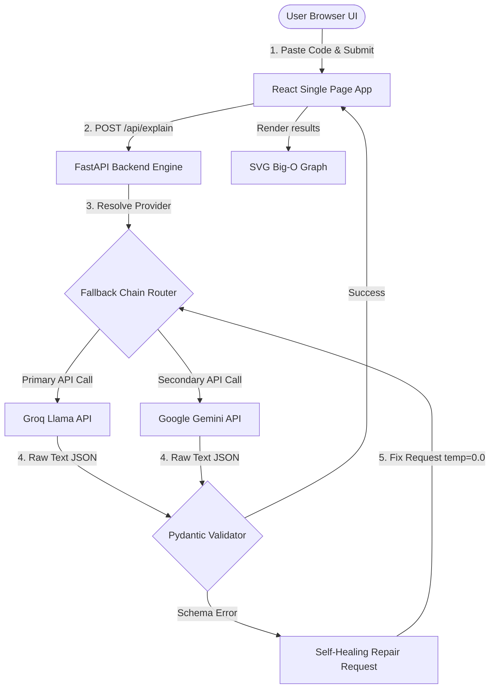

# CodeLearn: Plain-English AI Code Explanation Tutor

[](LICENSE.md)
[](https://fastapi.tiangolo.com)
[](https://react.dev)
[](https://www.typescriptlang.org)

CodeLearn is an educational web application designed to translate complex source code snippets into structured, beginner-friendly, plain-English explanations. The application provides line-by-line code walkthroughs, algorithmic complexity evaluations (with interactive SVG Big-O curves), interactive quizzes, and follow-up Q&A chat panels.

This project is submitted as the final **BTech CSE 3rd Year Summer Training Internship Project** at Lovely Professional University (LPU) for the **AI Engineering Launchpad**.

---

## Project Screenshots & Demos

### Product Interface Mockup


### Big-O Complexity Graph Mockup


---

## Table of Contents
1. [Project Overview](#project-overview)
2. [Motivation & Objectives](#motivation--objectives)
3. [Key Features](#key-features)
4. [Technology Stack](#technology-stack)
5. [System Architecture](#system-architecture)
6. [Folder Structure](#folder-structure)
7. [Installation & Setup](#installation--setup)
8. [Configuration & Environment Variables](#configuration--environment-variables)
9. [Detailed Workflow](#detailed-workflow)
10. [Academic Evaluation (Viva & Interview Qs)](#academic-evaluation-viva--interview-qs)
11. [License & Contact](#license--contact)

---

## Project Overview

### Problem Statement
Beginner programmers and computer science students often struggle to understand existing codebases. Traditional AI assistants explain *what* a code block does in a single text paragraph but fail to break down *why* statements execute, how variables change, or how the space and time complexities scale. This results in passive copying rather than learning.

### Solution
CodeLearn bridges this gap by outputting structured, multi-section explanations. Each code submission is parsed into six distinct pedagogical cards:
1. **Overview Statement**: A concise summary of the program's intent.
2. **Plain-English Description**: A plain explanation of the logical workflow.
3. **Time Complexity Analysis**: Big-O growth rate with mathematical reasoning.
4. **Space Complexity Analysis**: Memory consumption metrics with reasoning.
5. **Interactive Complexity Chart**: Real-time rendering of mathematical Big-O curves highlighting active bounds.
6. **Line-by-line Walkthrough**: Deep-dive collapsible accordion rows containing isolated code segments and annotations.
7. **Suggested Improvements**: Actionable refactoring cards covering readability, performance, and bug risks.

---

## Motivation & Objectives

### Project Motivation
As a Computer Science student, I found that reading existing code is often harder than writing new code. Our objective was to create a tool that acts as a 24/7 personal coding tutor, helping peers build programming intuition and prepare for technical viva evaluations.

### Objectives
* Develop a lightweight, fully-typed React single-page application using TypeScript and TailwindCSS.
* Build a high-performance ASGI backend using FastAPI to route requests asynchronously.
* Implement structured JSON response extraction from Large Language Models (Groq Llama / Google Gemini) using Pydantic schemas.
* Design a self-healing "repair-retry" loop pattern on the backend to automatically correct invalid LLM outputs.
* Build a custom interactive vector SVG graph charting algorithmic scales from constant to exponential.

---

## Key Features

* **Interactive Monaco Editor**: Integrates Microsoft's code editor with custom themes, font controls, find/replace overlays, and error boundaries.
* **Premium Thinking Loader**: Shows shimmering skeleton UI components and cycles through analytical operations, reducing bounce rates.
* **Self-Healing LLM Pipelines**: Backend detects structural errors in JSON strings, queries the model with diagnostic reports, and repairs output.
* **Side-by-Side Complexity Analysis**: Compares space and run-time parameters with animated indicator dots plotting coordinates on an SVG grid.
* **Interactive Comprehension Quizzes**: Dynamically generates multiple-choice questions matching code logics to test active learning.
* **Context-Aware Follow-Up Chat**: Supports direct conversational Q&A relative to the submitted snippet and conversation history.
* **Export Menus**: Allows printing or copying explanations as markdown files or PDF documents.
* **Local Caching History**: Saves past scans in the browser's localStorage for offline reviews.

---

## Technology Stack

### Frontend
* **Core**: React (v18.2), TypeScript (v5.0)
* **Styling**: TailwindCSS, Lucide React (icons), Framer Motion (stagger animations)
* **Editor**: `@monaco-editor/react` (Microsoft Monaco Editor integration)
* **Parsers**: `react-markdown` (safe inline rendering)

### Backend
* **Core**: Python (v3.10), FastAPI (ASGI web framework), Uvicorn (ASGI server)
* **LLM Engine**: Groq Cloud REST client, Google Generative Language REST API (`v1beta`)
* **Validation**: Pydantic v2 (schema constraints validation)
* **Networking**: HTTPX (asynchronous HTTP calls)

---

## System Architecture

The following block diagram outlines the flow of data from the frontend interface to the AI inference engines:



---

## Folder Structure

```
├── backend/
│   ├── app/
│   │   ├── api/
│   │   │   └── routes/         # Endpoint route handlers (explain, quiz, chat)
│   │   ├── config/             # Environment settings and model registries
│   │   ├── core/               # Shared custom exceptions
│   │   ├── models/             # Pydantic schemas (requests, explanations, quizzes)
│   │   ├── prompts/            # System directives and system instructions
│   │   ├── services/           # Business logics (chat, explanations, quizzes)
│   │   │   └── llm/            # Abstract and concrete LLM providers
│   │   ├── main.py             # FastAPI App factory and error handlers
│   │   └── static.py           # Serving built React app inside backend
│   ├── requirements.txt        # Python package dependencies list
│   └── server.py               # Supervisor / Uvicorn entrypoint script
├── frontend/
│   ├── public/                 # HTML templates
│   ├── src/
│   │   ├── components/         # Sub-components grouped by features
│   │   ├── examples/           # Mock code templates for example pickers
│   │   ├── hooks/              # Custom reusable hooks (localStorage, theme)
│   │   ├── lib/                # API clients, syntax highlighter parser, types
│   │   ├── pages/              # Primary route pages (HomePage, AboutPage)
│   │   ├── App.tsx             # Root page layout router
│   │   ├── index.css           # Custom CSS styling tokens and keyframes
│   │   └── index.tsx           # React entry point
│   ├── tailwind.config.js      # Layout style tokens
│   └── tsconfig.json           # TypeScript compilation configurations
├── docs/                       # Comprehensive academic project files
└── README.md                   # This document
```

---

## Installation & Setup

### Backend Installation
1. Navigate into the backend directory:
   ```bash
   cd backend
   ```
2. Create a Python virtual environment:
   ```bash
   python3 -m venv .venv
   source .venv/bin/activate
   ```
3. Install dependencies:
   ```bash
   pip install -r requirements.txt
   ```
4. Create and configure your environment files:
   ```bash
   cp .env.example .env
   ```
5. Run the FastAPI development server:
   ```bash
   uvicorn server:app --host 127.0.0.1 --port 8001 --reload
   ```

### Frontend Installation
1. Open a new terminal and navigate to the frontend directory:
   ```bash
   cd frontend
   ```
2. Install npm node modules:
   ```bash
   npm install
   ```
3. Start the Vite/React development server:
   ```bash
   npm start
   ```
4. Open your browser and navigate to `http://localhost:3000`.

---

## Configuration & Environment Variables

Create a `.env` file under the `/backend/` folder and configure the following parameters:

```env
# Secret credentials (Required)
GROQ_API_KEY=gsk_your_groq_api_key_goes_here
GEMINI_API_KEY=AIzaSy_your_gemini_api_key_goes_here

# Provider Configuration
ACTIVE_PROVIDER=groq
ACTIVE_MODEL=llama-3.3-70b-versatile
REQUEST_TIMEOUT_SECONDS=45

# Allowed Origins for CORS policy
ALLOWED_ORIGIN=http://localhost:3000

# Logging parameters
LOG_LEVEL=INFO
```

---

## Detailed Workflow

1. **User pastes a snippet** inside the Monaco Editor, selects an active model (e.g. Gemini 1.5 Flash), and clicks **Explain**.
2. **Frontend UI** triggers a transition loading state, showing a bouncing brain vector, pulsing rings, and shimmering card skeletons. The browser scrolls smoothly down to the results container anchor.
3. **Frontend POST request** is sent asynchronously to `/api/explain`.
4. **Backend FastAPI Router** validates the request payload and hands it to `generate_explanation`.
5. **Orchestrator resolves the model configurations**, loads the prompt templates, and executes the primary LLM call via the selected provider API wrapper.
6. **Self-Healing Loop**:
   * If parsing the raw text JSON fails validation due to LLM errors, the backend executes an automatic repair attempt.
   * It sends a follow-up completion request to the provider containing the previous raw output alongside Pydantic's exact validator report.
   * The repaired content is parsed and returned. If it still fails, the orchestrator steps into the next fallback provider (switching from Groq to Gemini).
7. **The verified JSON explanation payload** is received by the frontend and mapped into the responsive results cards.
8. **User takes quizzes**, prints outputs, or chats with the assistant.

---

## Academic Evaluation (Viva & Interview Qs)

### Common Technical Viva Questions

#### 1. Why did you use FastAPI instead of Flask or Django?
*FastAPI is an ASGI (Asynchronous Server Gateway Interface) web framework, whereas Flask is WSGI-based. FastAPI supports Python's `async/await` syntax natively, which allows it to handle thousands of concurrent network connections (like waiting for LLM APIs) without blocking the thread pool. Additionally, it compiles automatic OpenAPI schemas using Pydantic validation models.*

#### 2. What is Pydantic and how is it used in your project?
*Pydantic is a data validation library in Python. We use it to define strict structures (schemas) for requests and responses. By declaring models like `ExplanationResponse` inheriting from `BaseModel`, FastAPI validates that incoming payloads or LLM string outputs match our types exactly, converting unstructured texts into structured dictionaries.*

#### 3. How does the Self-Healing "repair loop" work in your LLM pipeline?
*When LLM providers return outputs, they can violate JSON schemas by omitting fields or appending plain conversations. If our Pydantic validator throws a `ValidationError`, we trigger a repair loop. We make a secondary call to the provider with temperature set to 0.0 (maximum determinism), feeding it the invalid output and Pydantic's error messages, directing it to fix the schema. This self-healing architecture reduces 502/500 errors.*

#### 4. How did you implement the Google Stitch-style navbar blur?
*We separated the navbar content from its background container. We applied an absolute background div styled with `backdrop-filter: blur(16px)` and a linear gradient `mask-image` (`linear-gradient(to bottom, black 35%, rgba(0,0,0,0.5) 70%, transparent 100%)`). This blends the background blur seamlessly into the page contents below without sharp rectangular borders.*

#### 5. Why does the O(1) complexity line sit exactly on top of the x-axis?
*In SVG charting, coordinate (0,0) is top-left. Our X-axis baseline is drawn at `y = 170`. Constant complexity $O(1)$ means operations are independent of input size ($y = c$). We mapped the O(1) line to run from `y1 = 170` to `y2 = 170` to lay it directly on top of the baseline. We used `filterUnits="userSpaceOnUse"` on the SVG glow filter to prevent SVG from collapsing lines with zero bounding height.*

---

## License & Contact

Distributed under the MIT License. See [LICENSE.md](LICENSE.md) for details.

* **Author**: Mohammad Fayas Khan
* **GitHub**: [github.com/MohammadFayasKhan](https://github.com/MohammadFayasKhan)
* **LinkedIn**: [linkedin.com/in/mohammadfayaskhan](https://www.linkedin.com/in/mohammadfayaskhan)
