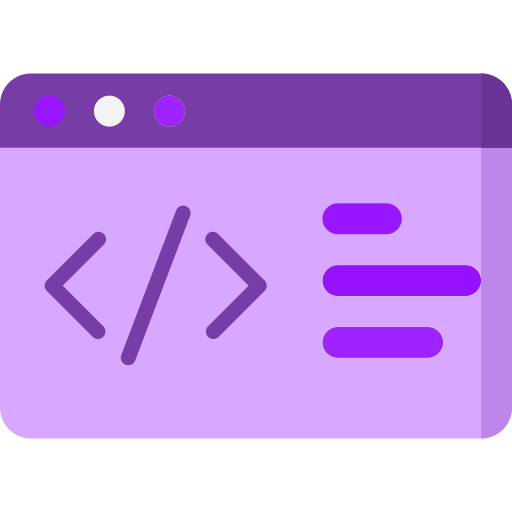
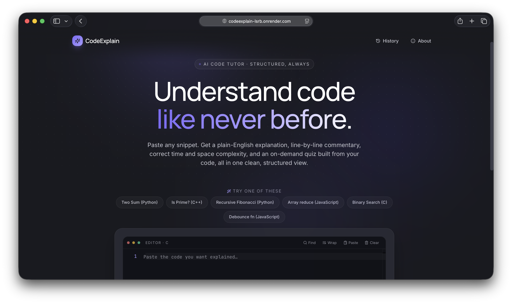

<div align="center">
  
  <h1>Code Explain: Plain-English Code Tutor</h1>
  <p><strong>AI-Powered Code Explanation & Interactive Learning Suite</strong></p>
  <p>A sleek, dark-themed code tutor powered by Groq's high-speed Llama 3/Qwen models and Google's Gemini APIs, with a FastAPI backend and React/TypeScript frontend.</p>

  <p>
    <a href="https://codeexplain-lsrb.onrender.com/" target="_blank">
      
    </a>
    
    
    
    
    
    
  </p>

  <br/>

  <p align="center">
    
  </p>
</div>

> 🚀 **Live Demo:** [https://codeexplain-lsrb.onrender.com/](https://codeexplain-lsrb.onrender.com/)

---

## 📖 Overview

CodeExplain turns raw, complex code snippets into structured, educational, and interactive study pages. Paste any block of code, choose its language (Python, JavaScript, TypeScript, C++, C, Go, etc.), and select an AI provider. In under 3.5 seconds, CodeExplain streams a deterministic JSON schema containing a complete summary, beginner-friendly explanations, Big-O complexity analysis, line-by-line runtime walkthroughs, and actionable improvements.

Every single visual transition (boot, home, loading, results, chat, quiz, error, success) is animated smoothly using non-blocking, modern layout architectures. There isn't a single blocking operation in the user interaction path.

---

## 🔄 System Flow

<p align="center">
  
</p>

---

## ✨ Features

- **Structural Code Breakdown:** Pediatric summaries focused on the "why" and "how" of code blocks.
- **Big-O Complexity Graph:** Correct Time and Space complexity metrics visualized on an interactive graph.
- **Interactive Line Gutter:** Hovering over lines of code highlights corresponding explanatory annotations.
- **Dynamic Quiz Panel:** Evaluates your understanding with 3-5 multiple-choice questions compiled from your code snippet.
- **Context-Scoped Follow-Up Chat:** Ask specific follow-up questions about the code snippet. Conversation history is maintained per browser tab session.
- **Markdown & PDF Export:** One-click downloads to save your structural reports offline.
- **Privacy-First Local Storage:** Saves history and settings locally. Data never leaves your device and can be cleared instantly.

---

## 💻 Tech Stack & Dependencies

### Frontend
| Technology | Purpose | Notes |
|---|---|---|
| React 18 | Client SPA UI | Powered by modern state Hooks and React-Router-DOM |
| TypeScript | Type safety | Complete type parity with backend Pydantic models |
| Tailwind CSS | Styling system | Styled using the custom geometric Stitch design system |
| Framer Motion | Smooth UI Animations | Manages 60 FPS transitions, drawer reveals, and entry fades |
| jsPDF | Client-side PDF export | Compiles analysis results into print-ready PDF files |
| Monaco Editor | Code input terminal | Code highlighting and syntax checking for multiple languages |

### Backend
| Technology | Purpose | Notes |
|---|---|---|
| Python 3.11+ | Execution engine | Stateless backend orchestration |
| FastAPI | REST API Server | Fast, async router handling `/api/*` endpoints |
| Pydantic v2 | Schema validation | Enforces strict validation shapes on LLM outputs |
| HTTPX | LLM Provider gateway | Handles retries and connection pooling for Groq/Gemini calls |

---

## 📁 Project Structure

```
CodeExplain/
├── backend/
│   ├── app/
│   │   ├── api/routes/         # Endpoint routing (explain, chat, quiz, health, models)
│   │   ├── config/             # Model registries and environment settings
│   │   ├── core/               # Exception handling and app overrides
│   │   ├── models/             # Pydantic schemas (Request & Response contracts)
│   │   ├── prompts/            # System instruction prompts for LLM providers
│   │   ├── services/           # Orchestration logic (explanation, chat, and quiz handlers)
│   │   ├── static.py           # Static mount routing for React build assets (SPA fallback)
│   │   └── main.py             # FastAPI startup and middleware configuration
│   ├── server.py               # Backend gateway entrypoint
│   └── requirements.txt        # Python package manifest
├── frontend/
│   ├── public/                 # Static assets and index wrapper
│   ├── src/
│   │   ├── components/         # Modular components (chat, input, layout, quiz, result, shared)
│   │   ├── hooks/              # Async hooks (useExplain, useQuiz, useChat)
│   │   ├── lib/                # API fetch wrappers, type mappings, storage handlers
│   │   ├── examples/           # Pre-built code samples for instant demoing
│   │   ├── App.tsx             # Root router and layout wrapper
│   │   ├── index.tsx           # Dom mounter
│   │   └── index.css           # Global typography, Stitch tokens, and animations
│   ├── package.json            # Node configuration
│   └── tsconfig.json           # TypeScript rules
├── static/
│   └── preview.png             # UI preview image
├── Dockerfile                  # Production multi-stage build container
├── PROMPT.md                   # Master Build Prompt (technical blueprint)
├── PROMPT ENGINEERING METHODOLOGY.md  # Companion prompt-engineering analysis guide
├── DEBUGGING_PROMPT.md         # Case study documenting debugging and performance hardening
└── README.md                   # Repository documentation
```

---

## 🚀 Getting Started

### Prerequisites

- **Python 3.11+** installed
- **Node.js 18+ and npm** installed
- An API key for **Groq** or **Google Gemini**

### 1. Clone the repo

```bash
git clone https://github.com/MohammadFayasKhan/CodeExplain.git
cd CodeExplain
```

### 2. Configure Local Settings

#### Backend Environment Setup
Create a `.env` file in the `backend/` directory:
```env
GROQ_API_KEY="your_groq_api_key_here"
GEMINI_API_KEY="your_gemini_api_key_here"
ACTIVE_PROVIDER="groq"
ACTIVE_MODEL="openai/gpt-oss-120b"
ALLOWED_ORIGIN="http://localhost:3000"
LOG_LEVEL="INFO"
```

#### Frontend Environment Setup
Create a `.env` file in the `frontend/` directory:
```env
REACT_APP_BACKEND_URL="http://localhost:8000"
```

### 3. Run the App

#### Start Backend
```bash
cd backend
python3 -m venv .venv
source .venv/bin/activate
pip install -r requirements.txt
python server.py
```
*Backend runs at [http://localhost:8000](http://localhost:8000)*

#### Start Frontend
```bash
cd ../frontend
npm install
npm start
```
*Frontend runs at [http://localhost:3000](http://localhost:3000)*

---

## 🐳 Production Build (Docker)

To run the unified, single-container build locally:

1. Build the Docker image from the root directory:
   ```bash
   docker build -t codeexplain:latest .
   ```
2. Run the container:
   ```bash
   docker run -p 7860:7860 \
     -e GROQ_API_KEY="your_groq_api_key_here" \
     -e GEMINI_API_KEY="your_gemini_api_key_here" \
     codeexplain:latest
   ```
3. Open [http://localhost:7860](http://localhost:7860) to view your running application.

---

## 🧠 Prompt Engineering & Methodology

This project is designed and built utilizing structured prompt engineering methodologies at two distinct layers:
1. **The Build-Time Specification**: Formulated as a complete, non-conversational blueprint in [PROMPT.md](PROMPT.md) to guide an AI coding agent through execution without scope drift.
2. **The Deployed Run-Time Prompts**: Structured instructions, Pydantic JSON schemas, and context-isolated payload wrappers sent dynamically by the FastAPI backend to Groq and Gemini models.

These prompting layers map directly onto the techniques taught in the **AI Engineer Launchpad** course (Unit 2 — Prompt Engineering and Reasoning, CO2).

For the exhaustive analysis of this prompt strategy, technique mapping (specification prompting, context isolation, zero-shot vs few-shot decisions, reasoning patterns), and implementation limitations, please refer to the companion guide:
👉 **[PROMPT ENGINEERING METHODOLOGY.md](PROMPT%20ENGINEERING%20METHODOLOGY.md)**

---

### The Build Prompt Spec (`PROMPT.md`)

A high-fidelity system-level prompt was used to guide the development of this project. You can inspect the complete build instructions inside [PROMPT.md](PROMPT.md). Below is a summary of the core prompt specifications:

````markdown
# CodeExplain — Master Build Prompt

You are a senior full-stack engineer who ships lightweight, production-ready AI web applications — not demos that only survive a happy-path walkthrough. Build **CodeExplain**: a code-explanation tool that turns a pasted snippet into a structured, beginner-friendly teaching artifact. Build it end-to-end, autonomously, without asking clarifying questions. Where this document is silent, make the most sensible production-grade decision and record it in `README.md`.

**Guiding principle:** structure is the product. Any LLM can explain a piece of code if you ask it to. What makes this application valuable is that every response — across every language, every provider, every model — comes back in the exact same predictable shape, section by section, every time. Treat the structured-output contract below as the single most important piece of engineering in this build.

---

## 1. Tech Stack

- **Frontend:** React 18 + TypeScript, built with Vite. Tailwind CSS, configured against the Stitch-derived design tokens in Section 5.
- **Backend:** FastAPI (Python 3.11+), Pydantic v2 for every request/response boundary and for validating structured LLM output.
- **LLM Providers:** Groq (`llama-3.3-70b-versatile`, `openai/gpt-oss-120b` default, `qwen/qwen3.6-27b`) and Google Gemini (`gemini-2.5-flash`) behind one provider interface. Switching the active provider/model is a config change, never a code change. Automatic fallback to the next configured pair on failure.
- **Deployment:** a single Docker image on Render, with the compiled frontend served as static assets by FastAPI. In local/preview environments, the frontend (port 3000) and backend (port 8001) run as two processes under a standard supervisor setup — same codebase, no forked logic, only environment-variable-driven behavior (Section 6).
- Avoid any dependency, frontend or backend, that doesn't serve a requirement stated in this document.

## 2. Core Features — Tier 1 (Required)

1. **Code input** — paste or upload, language dropdown with auto-detect and manual override; Python and JavaScript must be fully correct at minimum.
2. **Overview** — a single-sentence purpose statement, shown first.
3. **Plain-English explanation** — beginner-level, jargon-free, analogies where useful.
4. **Time & space complexity** — correct Big-O for both, each with reasoning tied to the *actual* code structure (its loops, recursion, data structures) — not a plausible-sounding guess reused across snippets.
5. **Line-by-line commentary** — every meaningful statement gets its own explanation, rendered as separated, expandable cards.
6. **Suggested improvements** — specific, grounded in the submitted code: naming, performance, readability, structure.
7. **Fixed schema, every time** — all six sections above render in the same shape on every request, regardless of language, provider, or input complexity. This is the property the assignment cares about most; treat it as testable, not aspirational.
8. **Quiz Mode** — after an explanation is generated, produce 3–5 comprehension questions derived from *that specific code* (variable names, actual control flow — not a generic, code-agnostic bank). Mix of multiple-choice and predict-the-output. Answers stay hidden until the full quiz is submitted; show a score with per-question feedback.

## 3. Additional Features — Tier 2 (Required, kept deliberately small)

9. **AI follow-up chat** — scoped strictly to the current code + explanation. The live conversation doesn't need to survive a reload, but the parent analysis it belongs to is still captured by the local history in item 12.
10. **Export** — **both Markdown and PDF**, not one or the other.
11. **Example snippets** — two or three built-in examples per supported language, to populate the empty state.
12. **Persistent local history (Local Storage only)** — the complete analysis history and user preferences persist across reloads and full browser restarts, restored automatically on reopen. No database, no server-side storage of any kind for this feature — the backend stays fully stateless per request. Ship a dedicated "Clear History" action that requires explicit confirmation before deleting anything and returns the app to its true first-visit state.
13. **About / Creator page** — reachable from the nav bar and footer, styled to the same design system as the rest of the app (not a bare credits list). Cover: what CodeExplain does and why it was built; a feature-highlight card grid; a short privacy note ("your history is stored locally in your browser — nothing is uploaded or saved permanently, and you can clear it at any time"); a creator section credited to **Mohammad Fayas Khan**, Computer Science Engineering student and AI/full-stack developer, with GitHub, LinkedIn, and Instagram links as icon buttons; and a footer with copyright, version number, and License/Privacy/Terms links.

Nothing beyond items 1–13 is in scope. Do not build interview-question mode, flashcards, a solution-comparison tool, or anything else not explicitly listed — scope discipline is as much a deliverable here as the features themselves.

## 4. Structured Output Contract

Every successful `/api/explain` call returns one fixed JSON shape:

```
overview: string
plain_english_explanation: string
time_complexity: { big_o: string, reasoning: string }
space_complexity: { big_o: string, reasoning: string }
line_by_line: [{ line_range, code_snippet, explanation }]
improvements: [{ title, detail, category }]
detected_language: string
provider_used: string
model_used: string
```

The system prompt must state this schema explicitly, forbid markdown fences or prose outside the JSON, and instruct the model to reason about the *submitted* code's actual structure rather than pattern-matching to a familiar algorithm. Validate the response with Pydantic; on failure, make exactly one repair re-prompt carrying the validation error; on a second failure, return a typed error — never let malformed or partial output reach the UI. Quiz generation (`/api/quiz`) follows the same discipline: a fixed `QuizQuestion` schema, validated the same way.

## 5. Design System (Stitch-derived, dark-only)

- **Colors:** `#191a1f` background, `#2a2b35` surface card, `#3a3b47` pill surface, `#ffffff` CTA/primary text, `#7c6af7` iridescent accent — accent used only for atmospheric background blobs and small highlights, never as a large competing fill.
- **Radii:** pill `9999px`, card `24px`, button `20px`, badge `4px`. Never mix rounded and sharp corners in the same view.
- **Spacing scale:** 4 / 8 / 16 / 24 / 48 / 64 / 96px only — no arbitrary pixel values anywhere.
- **Typography:** **Manrope** for headlines/display type, **Inter** for body/UI text — freely licensed substitutes for the original Google Sans / Google Sans Text pairing. Keep every original size, weight, and line-height; only the typeface changes. Document the substitution briefly in `README.md`.
- **Layout:** dark hero with a subtle dot-grid texture and iridescent gradient blobs → a large rounded code-input card (chat-composer style) with language and model pill selectors and a white pill "Explain Code" CTA → results rendered as stacked surface-card sections below, in the fixed order from Section 2.
- WCAG AA contrast minimum on all text; flat elevation only — no invented shadows.

## 6. Deployment

- **Docker (production):** multi-stage build. Stage 1 builds the frontend (Vite/Node) to static assets. Stage 2 is a slim Python runtime that copies only the built assets and serves them from FastAPI, with an SPA fallback for client-side routes, mounted **after** every `/api/*` route so API paths are always matched first.
- Read the listening port from the `PORT` environment variable, defaulting to `7860` 
- `.dockerignore` excludes `node_modules`, `__pycache__`, `.git`, `.env`, and test/dev-only files. Final image contains no leftover Node/npm toolchain.
- **Dual environment, one codebase:** the same repository also runs unmodified under a standard supervisor setup for local/preview development — frontend on 3000, backend on 8001, as two processes. The only difference between the two environments is environment-variable-driven configuration (port, CORS origin, whether a built frontend exists to mount) — no `if environment == "..."` branching in application logic.
- CORS locked to the deployed origin in production; permissive to the local dev ports otherwise.
- `GET /api/health` for liveness checks — must never trigger a real LLM generation call.
- Structured logging to stdout; a global exception handler returns a clean, typed error envelope — never a raw traceback reaches the browser.
- `README.md` includes complete, copy-pasteable Render Web Service setup steps and the full list of required environment variables.

## 7. Security & Configuration

- `GROQ_API_KEY` and `GEMINI_API_KEY` load from environment variables only, validated once at startup, and are never hardcoded, logged, or sent to the frontend.
- `.env.example` (backend) ships with placeholder values only. No real credential ever appears in any file that reaches version control — not in `README.md`, not in `PROMPT ENGINEERING METHODOLOGY.md`, not in this file, not in a commit message.

## 8. Non-Negotiables

- No placeholders, no `TODO`s, no fake LLM output standing in for a real call.
- No feature is exposed in the UI half-finished — if it isn't done, it isn't visible.
- One consistent error-handling pattern and one consistent async-state pattern used everywhere, front to back.
- Every backend module and function carries a docstring; every non-trivial block of logic is commented with *why*, not just what.
- Validate the schema in Section 4 against real snippets — at least one loop-based, one recursive, one data-structure-heavy example per required language — before calling the explanation pipeline done.

## 9. Deliverables

Working application · `README.md` · `PROMPT.md` · `PROMPT ENGINEERING METHODOLOGY.md` · `Dockerfile` · `.dockerignore` · `backend/requirements.txt` · `frontend/package.json` · `backend/.env.example`.
````

---

### Detailed Prompting Technique Mapping

The table below outlines how specific prompt engineering patterns are applied at both the **Build-Time (Layer 1)** and **Run-Time (Layer 2)** stages:

| Technique | Layer | Implementation in CodeExplain |
| :--- | :--- | :--- |
| **Specification-Driven / Meta-Prompting** | Layer 1 | [PROMPT.md](PROMPT.md) outlines all technical specs, schemas, design system tokens, and phase gates up front to prevent agent ambiguity. |
| **System Prompting** | Layer 2 | [explanation_prompt.py](backend/app/prompts/explanation_prompt.py) and [quiz_prompt.py](backend/app/prompts/quiz_prompt.py) enforce behavioral logic separate from user code. |
| **Role Prompting** | Layer 1 & 2 | Layer 1 instructs the builder as a "senior developer"; Layer 2 anchors the LLM as a "patient computer science teaching assistant". |
| **Structured Output Schema** | Layer 1 & 2 | Enforced on the backend via Pydantic model validators ([explanation.py](backend/app/models/explanation.py)) and runtime JSON schema directives. |
| **Zero-Shot Prompting** | Layer 1 & 2 | Preferred over few-shot to avoid model anchoring biases on unique user-submitted algorithms. |
| **Self-Healing Loop (Closed Feedback)** | Layer 2 | [explanation_service.py](backend/app/services/explanation_service.py) automatically catches parsing failures, feeding the validation error back to the LLM at `temperature=0.0` for repair. |
| **Context Isolation** | Layer 2 | Follow-up conversation context in [chat_service.py](backend/app/services/chat_service.py) is strictly bounded to the code, explanation, and last 6 messages. |

For a complete breakdown of each technique, the reasoning behind our choices, and limitations, check out the **[PROMPT ENGINEERING METHODOLOGY.md](PROMPT%20ENGINEERING%20METHODOLOGY.md)** companion document.

---

## 🐞 Debugging Engineering Methodology

This repository includes a dedicated debugging guide, **[DEBUGGING_PROMPT.md](DEBUGGING_PROMPT.md)**, documenting the major technical investigations and structural resolutions carried out during development.

This document is **not** a simple changelog. Instead, it serves as a detailed engineering case study covering:
- **Root Cause Analysis**: Diagnosing complex failures to their underlying cause.
- **Debugging Methodology**: Systematic tracing, diagnostic instrumentation, and validation.
- **Architectural Investigations**: Evaluating component interfaces and state boundaries.
- **Rendering Issues**: Resolving layout anomalies, flash of unstyled content (FOUC), and transitions.
- **AI Pipeline Debugging**: Inspecting JSON parsing errors, temperature behavior, and validation failures.
- **Browser Compatibility Fixes**: Ensuring smooth runtime and layout consistency across Safari, Chrome, and Firefox.
- **Deployment Troubleshooting**: Resolving Render-specific container settings, environment variables, and build timing.
- **Performance Optimization**: Profile-driven enhancements to minimize Largest Contentful Paint (LCP) and main-thread block time.
- **React Rendering Investigations**: Addressing double-renders, hook dependency cycles, and state synchronization.
- **Backend Reliability Improvements**: Strengthening exception middleware and model fallback routines.
- **Production Hardening**: Security configurations, rate limiting, and system resilience.

### Why This Guide Exists

Modern software engineering extends far beyond writing clean code. Building robust, production-grade applications requires:
- **Systematic debugging** to isolate failures deterministically.
- **Hypothesis-driven investigation** to test and verify potential fixes.
- **Root cause analysis** to ensure issues are resolved permanently rather than patched superficially.
- **Validation** of data schemas, performance metrics, and UI responsiveness.
- **Performance profiling** to catch regressions in resource usage and load times.
- **Production testing** to observe system behavior under realistic deployment constraints.
- **Iterative refinement** based on diagnostic feedback and telemetry.

### Debugging Case Studies

The table below maps the primary focus areas covered in the engineering case study:

| Section | Description |
|---------|-------------|
| Frontend Debugging | Major UI architecture investigations |
| Backend Debugging | API and FastAPI debugging |
| AI Pipeline | Structured output validation and self-healing |
| Rendering | React rendering and layout debugging |
| Browser Compatibility | Safari, Chrome and responsive investigations |
| Performance | GPU acceleration and rendering optimization |
| Reliability | Fallback mechanisms and production stability |
| Lessons Learned | Engineering insights from debugging |

For the complete log of these investigations and their structural resolutions, refer to the full document:
👉 **[DEBUGGING_PROMPT.md](DEBUGGING_PROMPT.md)**

---

## 🤝 Contributing

Contributions, issues, and feature requests are welcome! Feel free to check the [issues page](https://github.com/MohammadFayasKhan/CodeExplain/issues).

## 📝 License

This project is open-source and available under the [MIT License](LICENSE).

---

## 👨‍💻 Developed By

<div align="center">
  <h3><strong>Mohammad Fayas Khan</strong></h3>
  <p><em>Computer Science Engineering student focused on AI, ML, and full-stack development. Passionate about building scalable, real-world solutions with strong engineering fundamentals.</em></p>

  <p>
    <a href="https://www.linkedin.com/in/mohammadfayaskhan" target="_blank">
      
    </a>&nbsp;
    <a href="https://github.com/MohammadFayasKhan" target="_blank">
      
    </a>&nbsp;
    <a href="https://www.instagram.com/fayaskhanx" target="_blank">
      
    </a>
  </p>
</div>
